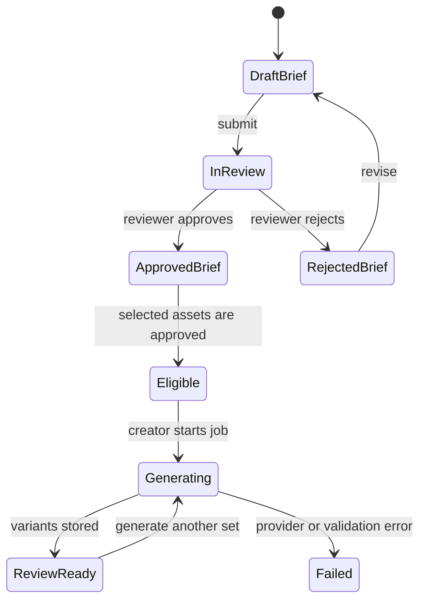
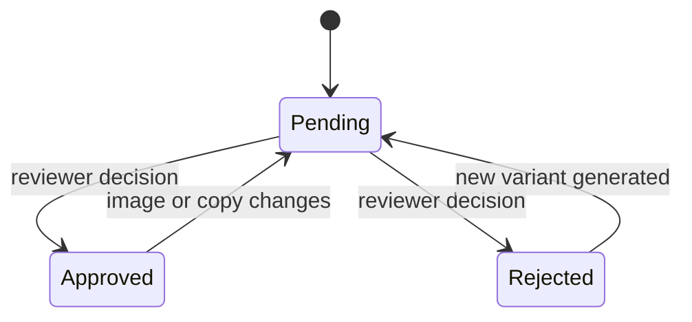
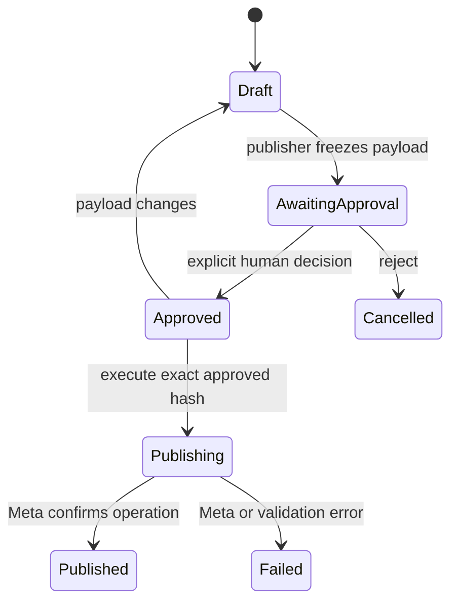

# Creative Production SaaS — MVP Specification

## Product promise

The product gives creative and performance-marketing teams one controlled path from an approved brand system and campaign brief to reviewable Meta image ads, with a human decision required before any publishing operation.

## Deliberate MVP boundary

| Included | Excluded from this release |
|---|---|
| Self-serve organization onboarding and team roles | Billing, subscription tiers, and usage metering |
| One active brand kit per organization | Multi-brand portfolios inside one organization |
| Approved logos, fonts, colors, claims, restrictions, and product images | Video generation, email, landing pages, blogs, and non-Meta channels |
| Meta image-ad briefs and AI-generated variants | General-purpose image editing or a free-form design canvas |
| Comments, side-by-side review, approve/reject decisions, and exports | Real-time cursors or live multiplayer editing |
| Human-approved create/update requests for Meta ads | Autonomous campaign changes or background auto-publishing |
| Append-only activity history with database mutation guards | Cross-channel analytics and budget optimization |

## Organization roles

| Role | Core permissions |
|---|---|
| **Owner** | Organization settings, members, brand kit, every review and publishing action |
| **Admin** | Members, brand kit, assets, briefs, creative review, and publishing |
| **Creator** | Draft briefs, upload assets, start eligible generation jobs, and comment |
| **Reviewer** | Review briefs and assets, approve or reject creatives, and comment |
| **Publisher** | Prepare Meta publish requests, approve publishing requests, and execute approved requests |

Every server procedure resolves the current user's membership from the organization identifier. A role check is performed on the server; hiding a control in the interface is never treated as authorization.

## Canonical objects

| Object | Purpose | Important states |
|---|---|---|
| **Organization** | Tenant boundary for every record and storage key | active |
| **Membership** | Connects a user to an organization and role | invited, active, suspended |
| **Brand kit** | Stores the approved visual and policy system | draft, active |
| **Brand asset** | Stores logo, font, product, reference, or other approved inputs | pending, approved, rejected |
| **Campaign brief** | Captures audience, offer, Meta placement, formats, claims, and direction | draft, in_review, approved, rejected |
| **Creative job** | Immutable snapshot of approved brief and selected asset inputs | queued, running, completed, failed |
| **Creative variant** | Generated image, copy, format, and review decision | pending, approved, rejected |
| **Comment** | Threaded review note attached to a brief or creative | open, resolved |
| **Meta connection** | Organization-specific Meta ad account and credential status | disconnected, connected, error |
| **Publish request** | Frozen payload describing a create or update operation | draft, awaiting_approval, approved, publishing, published, failed, cancelled |
| **Activity event** | Append-only statement of actor, action, entity, snapshot, and result | immutable |

## Generation eligibility state machine

The generation procedure must fail closed unless the brief is approved, every selected asset belongs to the same organization, every selected asset is approved, the brand kit is active, and the caller has permission. A generation job stores a JSON snapshot and deterministic hash of the approved brief, policy fields, and assets so later edits cannot silently change the inputs used for an existing result.

## Creative review state machine

Any modification to a creative's image, copy, call to action, format, or destination invalidates the prior approval and creates a new activity event.

## Controlled Meta publishing state machine

The execution procedure must re-check that the creative is still approved, the organization owns all referenced entities, the Meta connection is active, the publish request remains approved, and the current payload hash matches the approved hash. Any payload edit resets the request to draft. No scheduled or autonomous code path may call the publishing operation.

## Immutable activity contract

Each event records the organization, actor, action, entity type, entity identifier, request or state snapshot, outcome, request correlation identifier, and UTC timestamp. Application code exposes only insert and read operations. Every event also stores the previous event hash and its own deterministic hash, producing an organization-scoped cryptographic chain that the application verifies whenever the ledger is read. Any direct mutation or removal becomes detectable and the interface reports the ledger as unverified.

## Primary user journey

| Step | Experience | Completion signal |
|---|---|---|
| 1 | Create organization and choose role | Organization and owner membership exist |
| 2 | Configure brand identity and policy | Brand kit is active |
| 3 | Upload and approve source assets | At least one approved logo and product image exist |
| 4 | Create and approve campaign brief | Brief status is approved |
| 5 | Select approved inputs and generate | Multiple variants are persisted |
| 6 | Compare, comment, and approve a variant | One creative is approved |
| 7 | Configure Meta destination and freeze publish request | Request is awaiting approval |
| 8 | Explicitly approve and execute | Meta result and immutable events are recorded |

## Application structure

The public homepage explains the product and starts authentication. The authenticated application uses a focused workspace shell with **Home, Briefs, Creatives, Brand, Activity, and Settings**. Onboarding is a dedicated guided flow rather than another permanent navigation section.

## Acceptance invariants

| Invariant | Verification |
|---|---|
| A draft or rejected brief cannot start generation | Server test expects a forbidden or precondition failure |
| A pending or rejected asset cannot be sent to the image model | Server test verifies no model call occurs |
| Records from another organization cannot be read or mutated | Tenant-isolation tests for every protected router |
| A creative edit invalidates its approval | Mutation test expects status to return to pending |
| A publish payload edit invalidates publish approval | Hash and state-transition test |
| Publish execution without explicit approval is impossible | Server test expects a precondition failure and no Meta call |
| Activity events are append-only and tamper-evident | No application mutation exists and hash-chain verification fails after a direct edit or deletion |
| Every publish attempt is logged, including failure | Transactional router test checks activity insertion in success and error paths |
